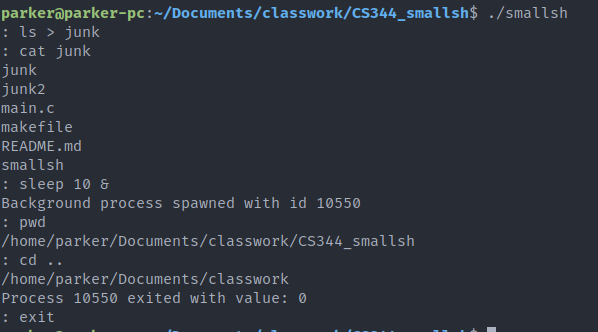

# CS344 | smallsh

Parker Carlson | February 7th, 2022

## About

A simple UNIX shell, coded in C, for OSU's CS344: Operating Systems I class.

## Features

1. "Native" execution of `exit`, `cd`, and `status` commands
   * `exit`   - Kills all child processes and exits the shell
   * `cd`     - Changes to the directory which `smallsh` was ran in
   * `cd dir` - Changes to the provided directory. Supports relative and absolute paths
   * `status` - Prints the exit status or terminating signal of the last foreground process
2. Execute all other commands via `fork()` and `exec()`
3. Support input and output redirection via `<` and `>`
4. Support running commands as a background process via `&`
   * Unless otherwise specified, standard IO is redirected to `/dev/null`
5. Expand `$$` into `smallsh`'s process ID
6. Custom exception handling for `SIGINT` and `SIGSTP`
   * `Ctrl+C` or `SIGINT` - Foreground proccess terminate themselves, background processes and `smallsh` ignore signal
   * `Ctrl+Z` or `SIGSTP` - Child processes ignore signal, shell enters foreground-only mode until `SIGSTP` received again

## How To Use

Smallsh can be compiled on Unix systems via the provided Makefile and `make`.

Commands can be ran using:

`command [arg1 arg2 ...] [< input_file] [> output_file] [&]`

...where items in square brackets are optional.
